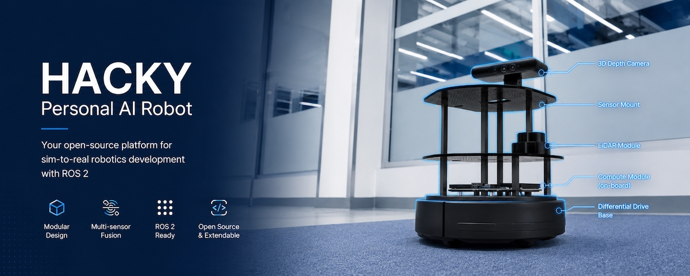

# Autonomous Deep Learning Robot



A from-scratch build of a Kobuki-based mobile robot running ROS 2 Jazzy on a Raspberry Pi 5, with a 2D lidar and an Orbbec Astra depth camera. The repo collects the hardware notes, setup docs, and deep-learning experiments needed to take the platform from "box of parts" to autonomously driving around a room.

The `external/` directory holds every upstream package as a pinned git submodule, so the build is reproducible end-to-end without chasing apt repos or random GitHub forks.

---

## System architecture

```
[Kobuki base]   ──USB-A↔B──┐
                            │
[RPLidar]       ──USB-A─────┼──→ [Raspberry Pi 5]
                            │           │
[Orbbec Astra]  ──USB-A─────┘           │ WiFi
                                         ▼
                                 [Workstation w/ rviz2]
```


Kobuki 12 V aux out → step-down → Pi 5 USB-C. Do not draw Pi power from the Kobuki USB-B port; it cannot supply 5 A.

---

## Getting started

Clone with submodules so the Kobuki / sensor driver sources land in `external/`:

```bash
git clone --recurse-submodules https://github.com/autonomous-ai/Personal-AI-Robot
# or, if you already cloned without --recurse-submodules:
git submodule update --init --recursive
```

Then work through the docs in order:

1. Hardware assembly and wiring _(to be updated)_
2. [Pi 5: Ubuntu 24.04 install + ROS 2 Jazzy](docs/02-pi5-setup.md)
3. [Kobuki: build the ROS 2 workspace](docs/03-kobuki.md)
4. [RPLidar driver](docs/04-rplidar.md)
5. [Orbbec Astra depth camera](docs/05-orbbec-astra.md)
6. First drive: teleop and basic verification _(to be updated)_
7. Deep learning on Pi 5: realistic options _(to be updated)_
8. Troubleshooting _(to be updated)_

Optional add-ons:

- [Remote access: Tailscale + NoMachine](docs/optional/remote-access.md)

---

## Bill of materials

Full parts list with quantities, categories, and photos: **[docs/bom.md](docs/bom.md)**.

Headline items: Kobuki mobile base, Raspberry Pi 5 (8 GB), Slamtec RPLidar, Orbbec Astra depth camera, 12 V → 5 V/5 A USB-C PD step-down. (Powered USB 3.0 hub is listed but optional — debug only.)

---

## Status

Tested on: Raspberry Pi 5 (8 GB), Ubuntu 24.04.3 LTS arm64, ROS 2 Jazzy Jalopy, Kobuki (firmware 1.2), Slamtec RPLidar C1, Orbbec Astra (serial 15102210050).

---

## Credits

- [kobuki-base](https://github.com/kobuki-base) maintainers — keeping the Kobuki stack alive on ROS 2 (source of the `external/kobuki_*` submodules)
- [Yujin Robot](https://github.com/yujinrobot/kobuki) — original Kobuki hardware and ROS 1 driver
- [IntelligentRoboticsLabs/kobuki](https://github.com/IntelligentRoboticsLabs/kobuki) — alternative ROS 2 fork worth cross-referencing
- Slamtec, Orbbec — driver SDKs
