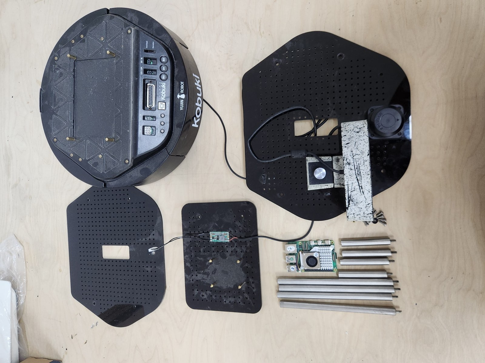

# 01 — Hardware assembly and wiring

The robot is a standard Turtlebot 2-style stack: Kobuki mobile base at the bottom, two or three perforated plates above it on threaded struts, with the Pi 5, lidar, and depth camera distributed across the plates.



Full step-by-step photos: [`photos/assembly/`](../photos/assembly/).

## Components

| Part | Purpose | Notes |
|---|---|---|
| Kobuki mobile base | Drive, wheels, gyro, cliff/IR sensors, battery, 12 V aux out | See [kobuki-base docs](https://kobuki.readthedocs.io/) (Yujin's original wiki is offline) |
| Kobuki docking station + PSU | Auto-recharge | Thread the supplied PSU lead through the rear hole into the roof socket |
| Plate + strut set | Turtlebot 2 frame | Black perforated plastic plates with stainless threaded struts |
| Raspberry Pi 5 (8 GB) | Compute, ROS 2 node host | M2.5 mounting holes |
| Active Cooler | Pi 5 thermal | Required under sustained ROS load |
| Slamtec RPLidar | 2D scan | USB; chip = Silicon Labs CP210x |
| Orbbec Astra | RGB + depth | USB; sits on top plate |
| 12 V → 5 V/5 A USB-C step-down (PD trigger) | Power Pi from Kobuki aux | Must assert 5 A PD capability |
| USB-A ↔ USB-B cable | Kobuki ↔ Pi data link | Listed in BOM but not shipped with the Kobuki retail kit — supply your own |
| Powered USB hub *(optional)* | Bench debugging | Pi 5's 4 USB ports are enough on-robot |

Some Kobuki kits also ship a small Bluetooth speaker. It is not in this build's BOM; ignore it or repurpose it later if you want voice output.

## Assembly

Yujin’s original modular build guide , working from the bottom up:

1. **Plate 1 (on the Kobuki):** struts in, Pi 5 mounted on M2.5 standoffs. Leave clearance around the Active Cooler intake. ([photo](../photos/assembly/13.jpg))
2. **Plate 2 (middle):** carries the RPLidar. The lidar's mounting screws use the perforated grid on the plate — center it on the robot's forward axis so `laser_link → base_link` doesn't need a yaw offset.
3. **Plate 3 (top):** carries the Orbbec Astra, pointing forward. ([photo](../photos/assembly/23.jpg))

Some kits include a plastic top cap ("I am Autonomous") — purely cosmetic, no electrical role.

Three things Yujin's diagrams skip that bite first-time builders:

1. The USB-A ↔ USB-B cable is not in the Kobuki box. The BOM lists it as item 12 — buy one if your kit didn't include one.
2. The Kobuki has a power switch on the rim of the base. Easy to miss; the robot is fully dark until it's flipped.
3. The dock has no internal cable. Open the rear cover, route the dock PSU through the side hole, plug into the socket on the roof of the compartment.

## Wiring

The on-robot configuration plugs every USB device directly into the Pi 5 — its four USB ports are enough:

```
Kobuki USB-B port    ──(USB-A↔B cable)──→  Pi 5 USB-A
Kobuki 12 V aux out  ──(step-down PD)─────→  Pi 5 USB-C (power)
RPLidar              ──(USB-A)─────────────→  Pi 5 USB-A
Orbbec Astra         ──(USB-A)─────────────→  Pi 5 USB-A
```

A powered USB 3.0 hub is **optional** and useful only on the bench when devices are spread out. Do not insert one between the Pi and the sensors on the robot — it adds a failure point.

## Power: never feed the Pi through the Kobuki USB-B port

The Kobuki USB-B port is a *data* connection — it does not supply enough current to power a Pi 5 under load. Always power the Pi from the 12 V aux output via the PD-capable step-down, or — for bench work — the official 27 W USB-C PSU.

Symptoms of an inadequate PSU on Pi 5: kernel `under-voltage detected` messages, USB devices disconnecting mid-session, ROS nodes dying with no obvious cause. Diagnose with:

```bash
vcgencmd get_throttled
```

Anything non-zero means the supply is sagging. Fix the power chain before you blame software.

## Quick power-on test (no software)

Borrowed from the Kobuki manual — useful for confirming the base itself works before you commit to ROS:

1. Charge the Kobuki battery to ≥ 50 %.
2. Flip the power switch on the rim.
3. Hold the **B0** button on the top of the base for ~2 s.

The base enters the "random walker" demo: drives in arbitrary directions, reverses off bumper contacts, and *should* respect cliff sensors. Put it on the floor in a clear area — cliff sensors are not a substitute for not driving it off a table. Expect it to be loud.

Power off with B0 again, or the rim switch.

## USB enumeration and stable device paths

`/dev/ttyUSB*` numbering is assigned in plug order, so it can shuffle on reboot. The two USB-serial devices on this robot use different chips, so udev can give each a stable symlink:

| Device | USB chip | Vendor:Product | Stable symlink (after udev rules from [03](03-kobuki.md) / [04](04-rplidar.md)) |
|---|---|---|---|
| Kobuki base | FTDI FT232R | `0403:6001` | `/dev/kobuki` |
| RPLidar     | Silicon Labs CP210x | `10c4:ea60` | `/dev/rplidar` |

Once those udev rules are installed, prefer the symlinks (`/dev/kobuki`, `/dev/rplidar`) — or the underlying `by-id` paths — in launch files. Never reference `/dev/ttyUSB0` directly. Inspect them with:

```bash
ls -l /dev/serial/by-id/
```

You'll see entries like:

```
usb-FTDI_Kobuki_kobuki_AL03EQCC-if00-port0       → ../../ttyUSB0
usb-Silicon_Labs_CP2102_USB_to_UART_...-if00     → ../../ttyUSB1
```

The Kobuki's `kobuki_*` serial is what the `60-kobuki.rules` rule matches on; that's why the symlink survives any re-plugging.

## Next

→ [02 — Pi 5: Ubuntu 24.04 + ROS 2 Jazzy](02-pi5-setup.md)
