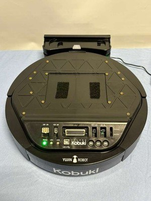
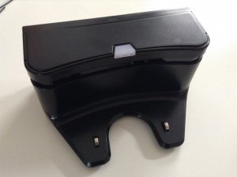
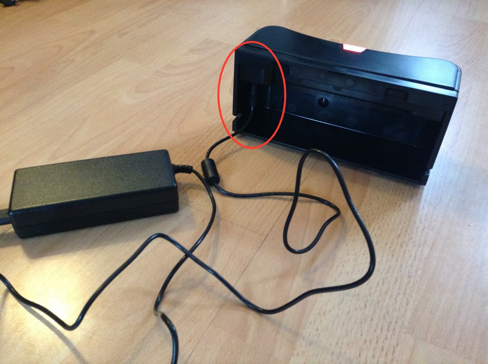
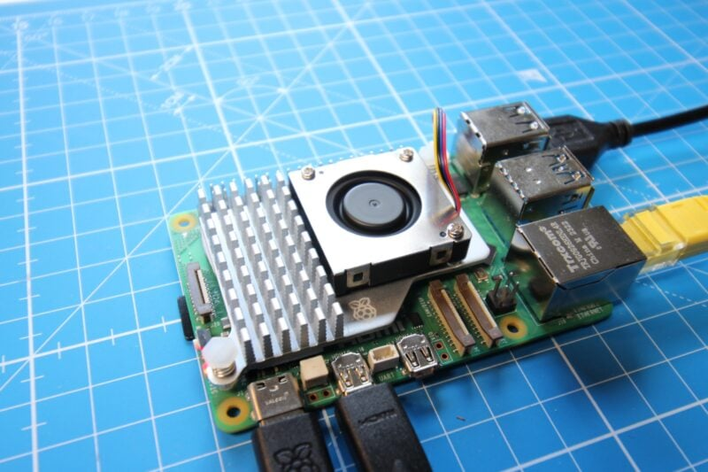
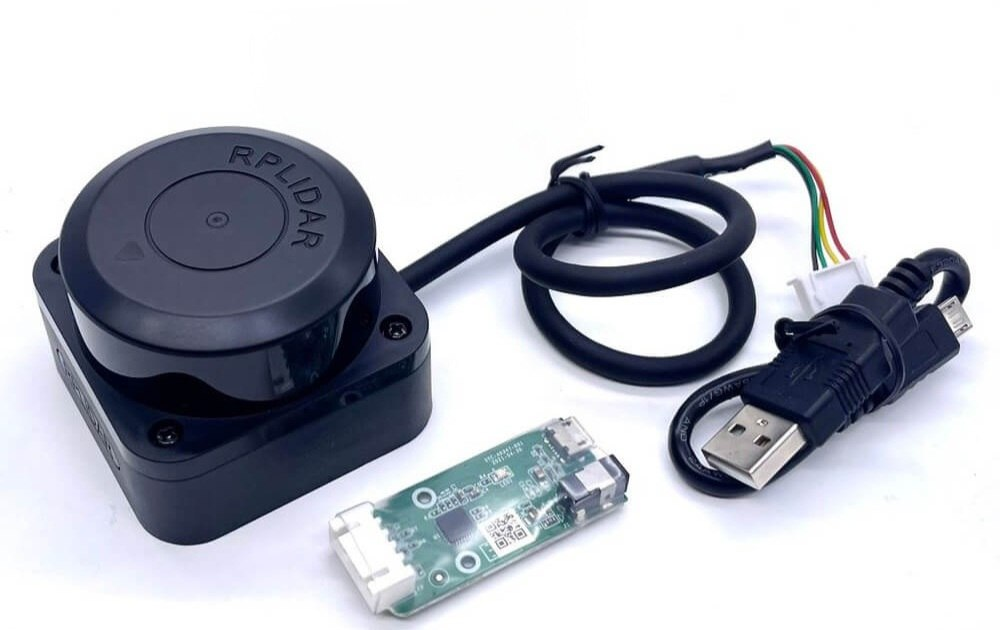
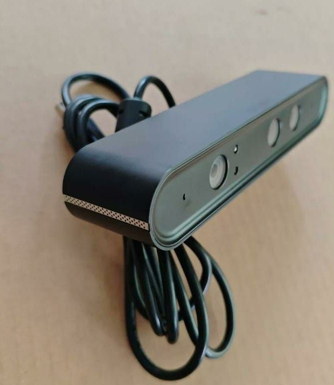
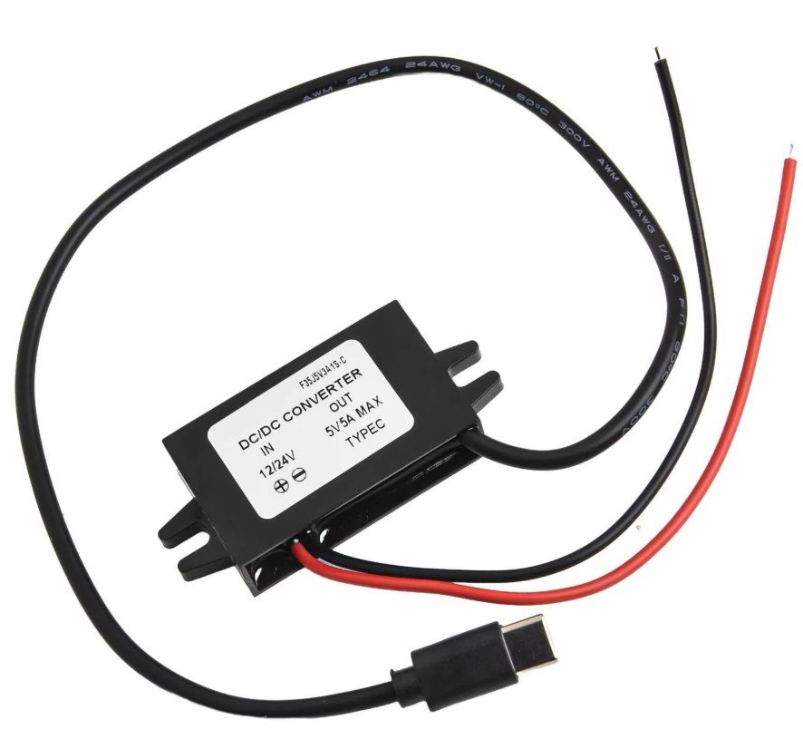

|No|Item|Qty|Category|Photo|Notes|
|:-:|:-:|:-:|:-:|:-:|:-:|
|1|Kobuki mobile base|1|Base|||
|2|Kobuki docking station + power supply|1|Power Supply| |Recharging adapter — Input: 100–240 V AC, 50/60 Hz, 1.5 A max; Output: 19 V DC, 3.16 A|
|3|Raspberry Pi5|1|Mainboard||8 GB recommended|
|4|Raspberry Pi Active Cooler|1|Cooling|||
|5|Raspberry Pi 27 W USB-C PD power supply|1|Cable||for desk use; on-robot power comes from Kobuki|
|6|Micro SD card: 64GB|1|Storage|||
|7|Slamtec RPLidar|1|Lidar||C1 / A1 / A2 — any 2D USB lidar|
|8|Orbbec Astra depth camera|1|3D Camera||or replace with Intel RealSense / Orbbec Gemini if Astra unavailable|
|9|Powered USB hub|1|USB Hub|||USB 3.0, externally powered — **optional**, for bench debugging when sensors are spread out from the Pi. On-robot, the Pi 5's 4 USB ports are enough to host Kobuki + RPLidar + Astra directly.|
|10|USB-C step-down regulator: 12V to 5V/5A USB-C PD trigger|1|Cable||to power the Pi from the Kobuki|
|11|Ethernet cable|1|Cable|||
|12|USB type A → type B cable|1|Cable||Kobuki control + power passthrough|
|13|Plate and Struts set|1|||1 set (full)|
